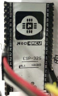
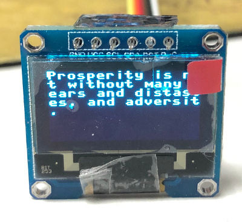
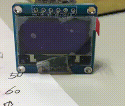

# SSD1306 for ESP32
  I didn't find the relevant driver on my board. But I find it in MicroPython‘s official code. Here's the [link](https://github.com/micropython/micropython/blob/master/drivers/display/ssd1306.py), you can just download this `.py` file.
But it doesn't work good in my ESP32 board. My board is NodeMCU's `ESP-32s`just like left picture and right is my SSD1306 OLED screen:<br />
   <br />
## use Screen.py
`Screen.py` just copy [this](https://github.com/micropython/micropython/blob/master/drivers/display/ssd1306.py) and modify a little.See a example:
```python
from machine import Pin,SPI
import Screen
import time

power=Pin(13,Pin.OUT)
power.value(1)
spi=SPI(1,sck=Pin(18,Pin.OUT),mosi=Pin(5,Pin.OUT),baudrate=24000000)

s = Screen.create(128, 64, spi, Pin(16,Pin.OUT), Pin(17,Pin.OUT))
s.print('Hello, world.')
```
I just add a function `print`, it work like `print` in python, Other features in [this](https://docs.micropython.org/en/latest/library/framebuf.html). What's more, I remove the `cs` in [official code](https://github.com/micropython/micropython/blob/master/drivers/display/ssd1306.py). Because my screen's CS has ground. So pin_13 is `vcc`, pin_18 is `SCL`, pin_5 is `SDA`, pin_16 is `D/C`, pin_17 is `RST`. Gif of function `print` as follows.<br />
<br />
Another, `_Screen` must create twice and I don't know why, you can see in function `Screen`, this may cause by error command, but I haveno time to learn SSD1306's command, this [pdf](https://cdn-shop.adafruit.com/datasheets/SSD1306.pdf) will help you.
My ESP32 board only costs ￥22($3) in taobao.com and screen costs ￥13($1.8). Cheap!